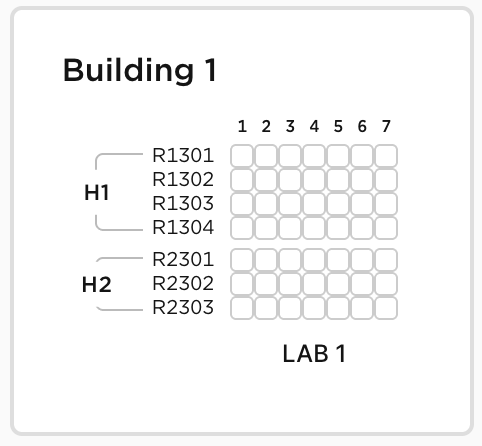

# React + TypeScript + Vite

This is the frontend application for the IUNU exercise. It allows users to select a facility and view its map using data from the backend API.

The stack is built using React with TypeScript and Vite for fast development and build times. Additional useful libraries installed and available are:

- Tanstack Query - For data fetching and caching
- Tailwind CSS - For styling and layout
- Lucide Icons - For icons

# Example of map rendering

[](./public/map-example.png)

## Setup and Run

```
npm install
npm run dev
```

```
open http://localhost:4444
```
